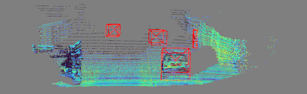

# RobDet3D
This repository is deeply inspired by [OpenPCDet](https://github.com/open-mmlab/OpenPCDet.git) and [MMDetection3D](https://github.com/open-mmlab/mmdetection3d.git), and incorporates their advantages.
In this repo, we develop `HAVSampler` and `GridBallQuery` to speed up `poin-based` model and its deployment.
# INSTALL
```bash
pip install -r requirements.txt
pip install spconv-cuxxx(e.g.cu113)
python setup.py develop
```
pre-train model can be downloaded from [Google Drive](https://drive.google.com/drive/folders/10TSrJhKvqB3NF0De12DJLBEFCKvcloZC?usp=share_link).

# Dataset
refer to [OpenPCDet](https://github.com/open-mmlab/OpenPCDet.git) to prepare your data:
```shell
mkdir data && cd data
ln -s path/to/your/kitti/dataset kitti
cd ../
python -m rd3d.datasets.kitti.kitti_dataset \
create_kitti_infos configs/base/datasets/kitti_3cls.py
``` 

# Training
train your model like this:
```shell
python tools/train.py \
--cfg configs/iassd/iassd_hvcsx1_4x8_80e_sparse_kitti_3cls.py \
wandb --group rd3d
```
or train with multi-GPU
```shell
accelerate launch tools/train.py \
--cfg configs/iassd/iassd_hvcsx1_4x8_80e_sparse_kitti_3cls.py \
wandb --group rd3d
```

# Export ONNX Model
```shell
python tools/deploy/export_onnx.py                                      \
--cfg_file configs/iassd/iassd_hvcsx1_4x8_80e_kitti_3cls\(export\).py   \
--ckpt tools/models/iassd_hvcsx1_4x8_80e_kitti_3cls\(export\).pth       \
--onnx tools/models/trt 
``` 
Then the exported onnx model can be found in fold `tools/models/trt`.

# Export TensorRT Model
```shell
python tools/deploy/export_trt.py                                         \
--onnx ./tools/models/trt/iassd_hvcsx1_4x8_80e_kitti_3cls\(export\).onnx  \
--batch 1                                                                 \
--type FP32  # FP32 / FP16 / INT8
```
## Test
```shell
python tools/deploy/test_trt_viz.py \
--engine ./tools/models/trt/iassd_hvcsx1_4x8_80e_kitti_3cls\(export\).engine
```
if susses, the following figure can be seen in the visualization window.


## Profile 
```shell
python tools/deploy/trt_profile.py                                            \
--engine tools/models/trt/iassd_hvcsx1_4x8_80e_kitti_3cls\(export\).engine    \
--batch 1                                                                     \
--build_in  # or not
```
And the following results will be shown in terminal:

|        name | layers | average (ms) | median (ms) | percentage (%) |
|------------:|-------:|-------------:|------------:|---------------:|
| HAVSampling |      1 |        0.106 |       0.102 |            0.9 |
|   BallQuery |      8 |        5.197 |       5.054 |           42.4 |
| ForeignNode |      8 |        4.144 |       4.079 |           34.2 |
|      NMSBEV |      1 |        0.137 |       0.137 |            1.1 |
|      Others |     48 |        2.402 |       2.358 |           19.8 |
|       Total |     66 |         12.0 |        11.9 |          100.0 |
